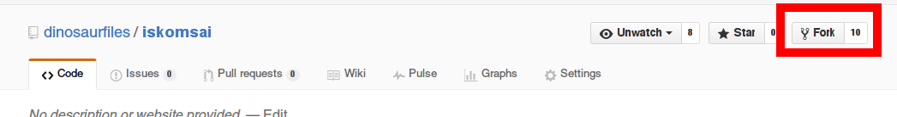
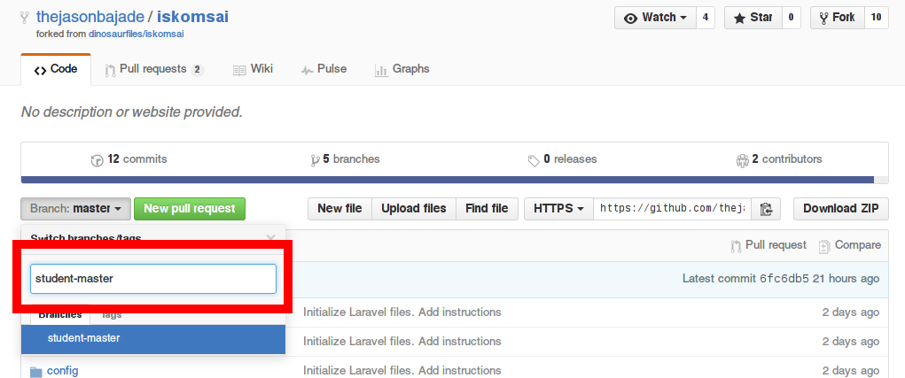
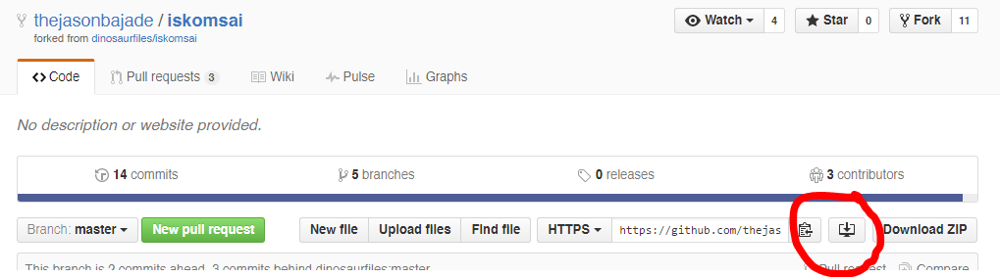
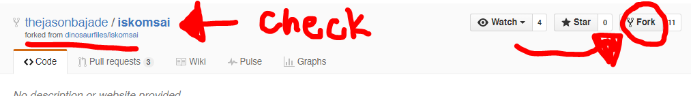
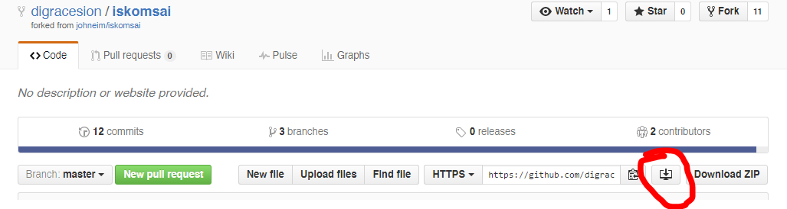
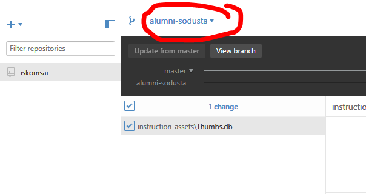
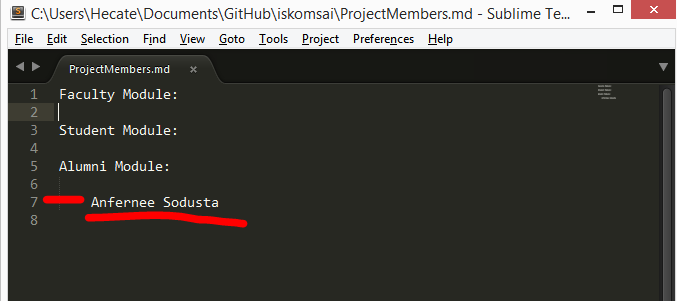
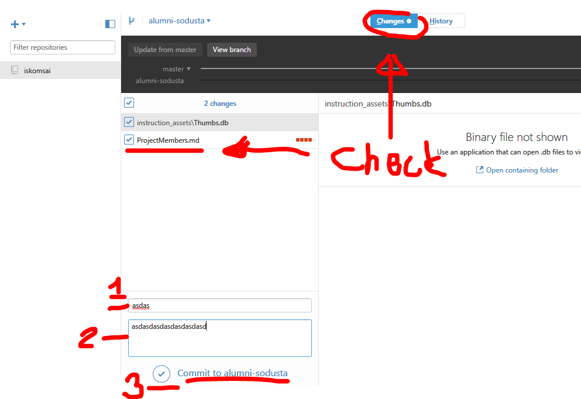
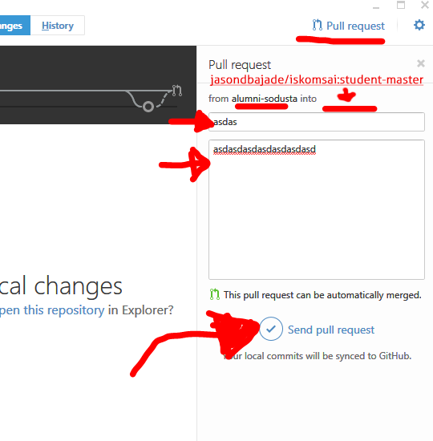

# Instructions

## Git Flow as shown below

# Instructions for **Team Leaders**
- Clone the `iskomsai` [repository](https://github.com/dinosaurfiles/iskomsai.git) by forking the repository on the `dinosaurfiles/iskomsai` on the main page.

    

- Add your team members as a collaborator on your **own** repository.

    

- On your own `iskomsai` repository (Ex: `jasondbajade/iskomsai`). Make a new `branch` with the corresponding name `<module_name>-master` (E.g. `faculty-master`, `student-master`, etc.).

    

    *This is where the code of all group members go.*

- Now, Clone your repository to your desktop

    

- Create another branch of with your name (E.g. `student-bbb`) and make sure that the `From branch` is the `module-master` branch

    

`Note:` Pull requests should be made when a feature is implemented successfully or not known bugs are found.

# Instructions for **Team Members**
- Fork the repository of your team leader and check if you have access to the repository.

    

- On your own `iskomsai` (Ex. `digracesion/iskomsai`) clone the repository to your desktop.

    

- Create another branch of with your name (E.g. `student-bbb`) and make sure that the `From branch` is the `module-master` branch

    

- Before you make your changes be sure you are on the right respective branch.

    

- Make the changes in the [`ProjectMembers.md`](ProjectMembers.md)! Be it on your favorite text editor or the CLI by inserting your name on your respective module.

    `Note:`**Project Leaders will do this as well**

    

    *This is actually a test to see if you can read/write on the repository*

- Check if the changes are done! And commit your code. Add some meaningful Title and Description.

    
    *Check the changes. Make sure that you committed on your own branch[3]*

- Its time to pull your code to the `module-master` repository!

    

## Done and Congrats! YEY !
*This is a sample test to apply your learned git skills such as the basic add-commit-push, and handling of merges conflicts.*

#### Having issues or need relationship advice? Catch us up on the #git channel on [Slack!](https://iskomsai.slack.com) :)
